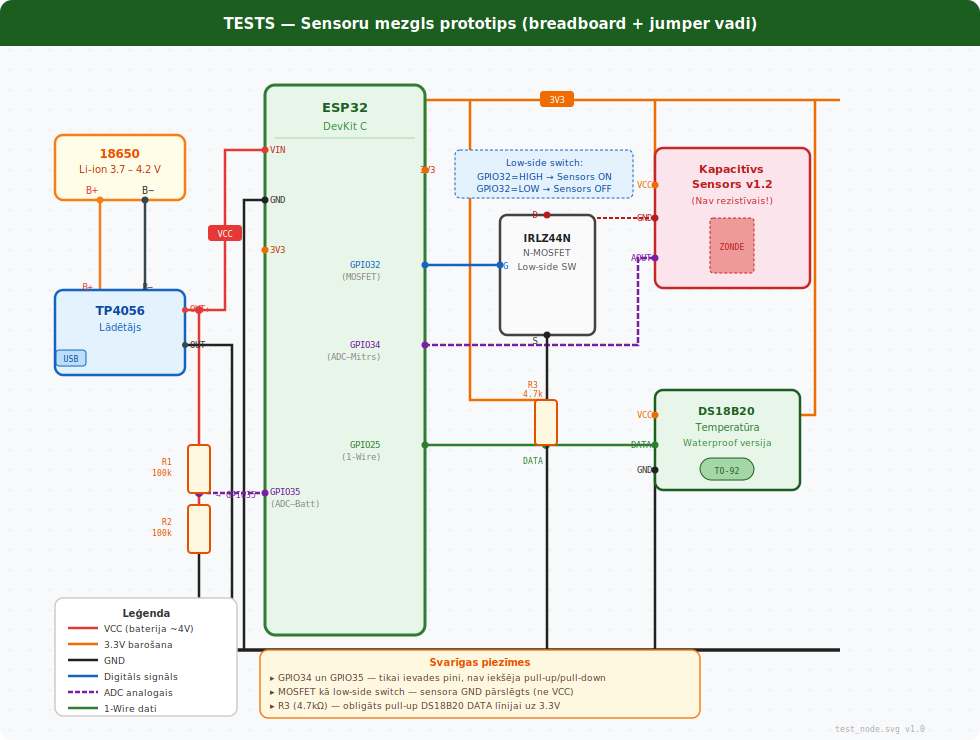
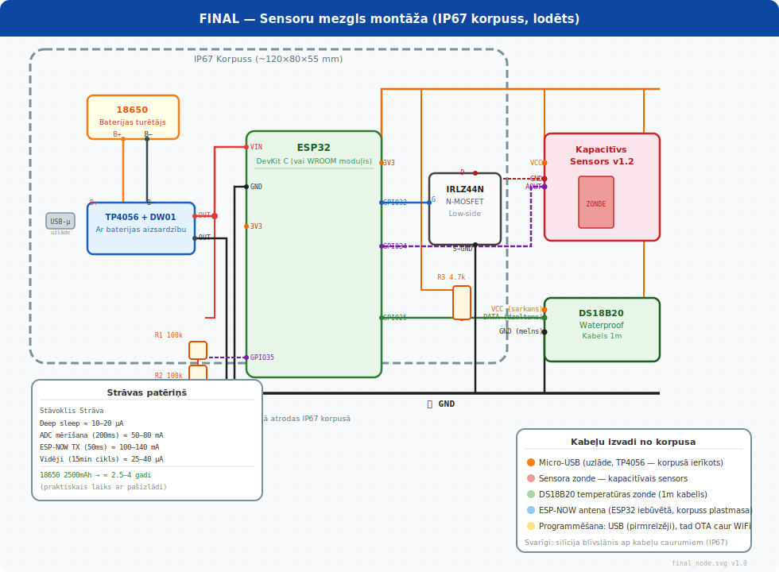
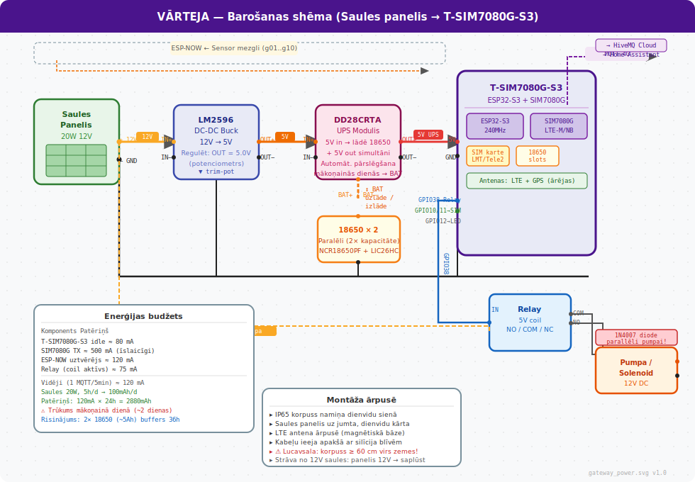

# IoT Augsnes Mitruma Sensoru Tīkls

Bezvadu sensoru sistēma dārza (438 m², Kazas sēklis, Lucavsala) un dzīvokļa augu mitruma monitoringam. Integrējas ar esošo Pixel 9 datu vākšanas sistēmu un Home Assistant.

---

## Arhitektūra

```
DĀRZS (5 km attālumā, bez elektrības)
┌─────────────────────────────────────────────┐
│  Sensoru mezgli (×10)                       │
│  ESP32 + kapacitīvs sensors + 18650         │
│  Deep sleep 15 min → mērīšana → sūta        │
│              │ ESP-NOW (200–400 m)           │
│              ▼                              │
│  Vārteja — T-SIM7080G-S3                    │
│  ESP-NOW uztvērējs + SIM7080G 4G            │
│  Saules panelis 20W + 18650 + LM2596        │
└──────────────┬──────────────────────────────┘
               │ MQTT over 4G (LTE-M/NB-IoT)
               ▼
          HiveMQ Cloud (bezmaksas)
               │
    ┌──────────┴──────────┐
    ▼                     ▼
Home Assistant      Web dashboard
(dzīvoklī)         (GitHub Pages PWA)
    │
    └── Dzīvokļa mezgli (×8)
        ESP32 + sensors + USB
        WiFi → MQTT tieši
```

---

## Hardware

### Sensoru mezgls (dārzs) — 1 mezgls

| Komponente | Daudzums | Piezīme |
|---|---|---|
| ESP32 DevKit C (38-pin) | 1× | Galvenais MCU |
| Kapacitīvs mitruma sensors v1.2 | 1× | Nav rezistīvais! |
| IRLZ44N MOSFET TO-220 | 1× | Sensora barošanas pārslēgšana |
| 18650 baterija | 1× | ≥ 2500 mAh (Panasonic/Samsung) |
| TP4056 + DW01 lādētājs | 1× | Micro-USB ieeja |
| DS18B20 temperatūras sensors | 1× | Waterproof versija |
| 4.7 kΩ rezistors | 1× | DS18B20 pull-up |
| 100 kΩ rezistors × 2 | 2× | Baterijas voltage divider |
| IP67 korpuss | 1× | Min. 100×68×50 mm |

Baterijas kalpošanas laiks: **6–12 mēneši** (15 min intervāls, 50 ms TX).

### Vārteja (dārzā, pie namiņa)

| Komponente | Daudzums | Piezīme |
|---|---|---|
| LILYGO T-SIM7080G-S3 | 1× | ESP32-S3 + SIM7080G iebūvēts |
| 18650 baterija (Panasonic NCR) | 1–2× | T-SIM7080G-S3 slotā |
| LM2596 DC-DC buck converter | 1× | 12V → 5V/3V3 |
| DD28CRTA UPS plate | 1× | Solar → uzlāde + 5V out vienlaikus |
| Saules panelis 20W 12V | 1× | Ar USB + 12V izejām |
| Relay moduļis 5V | 1× | Laistīšanas vadība |
| IP65 korpuss | 1× | Vārtejai + elektronikai |
| SIM karte (LMT/Tele2) | 1× | Datu tarifs |

### Dzīvokļa mezgls — 1 mezgls

| Komponente | Daudzums | Piezīme |
|---|---|---|
| ESP32 DevKit C | 1× | USB barošana |
| Kapacitīvs mitruma sensors v1.2 | 1× | |
| IRLZ44N MOSFET | 1× | |
| DS18B20 (nav obligāts) | 1× | |

---

## Shēmas

### Sensoru mezgls — tests (maketēšanas plāksne)



### Sensoru mezgls — finālā montāža (IP67)



### Vārtejas barošanas ķēde



### Sensoru mezgls — pievienojumi (teksts)

```
ESP32 DevKit C
                         ┌─── 3.3V
    GPIO32 ──┤IRLZ44N├── ┤    Kapacitīvs sensors
                         └─── AOUT ── GPIO34 (ADC)
                              GND  ── GND

    GPIO34  ← Sensors AOUT  (ADC1_CH6, tikai input)
    GPIO35  ← Baterijas mērījums
               [18650+] ── 100kΩ ── GPIO35 ── 100kΩ ── GND

    GPIO25  ← DS18B20 DATA
               DATA ── 4.7kΩ ── 3.3V

    TP4056 OUT+ ── 18650+ ── [voltage divider] ── ESP32 VIN (3.7V)
    TP4056 OUT- ── GND
```

### Vārtejas barošana (teksts)

```
Saules panelis 12V
      │
   LM2596 ──→ 5V
      │
  DD28CRTA ←→ 18650 (NCR × 2 paralēli)
      │
   5V out ──→ T-SIM7080G-S3 (USB-C vai 5V pin)

T-SIM7080G-S3 GPIO38 ──→ Relay IN ──→ Pumpa / vārsts
```

---

## Firmware iestatīšana

### Priekšnosacījumi

```bash
# PlatformIO (sensor_node un gateway)
pip install platformio

# ESPHome (apartment_node)
pip install esphome

# Kalibrācijas rīks
pip install pyserial
```

### 1. Sensor node — uzlāde

```bash
cd iot/sensor_node

# Mainīt NODE_ID pirms katras plāksnes uzlādes:
# src/main.cpp → #define NODE_ID "g01"   # g01..g10 dārzam

# Mainīt GATEWAY_MAC uz vārtejas MAC adresi
# (nolasa no vārtejas seriālā monitora pēc vārtejas uzlādes)

pio run --target upload
```

### 2. Sensor kalibrācija

Pēc firmware uzlādes, pirms montāžas:

```bash
cd iot/calibration
python3 calibrate.py          # automātiski atrod COM/USB portu

# Seko instrukcijai:
#  1. Sensors gaisā    → nospiež Enter → mēra sauso punktu
#  2. Sensors ūdenī    → nospiež Enter → mēra mitro punktu
#  3. Saglabā EEPROM   → CALIB_OK
```

Pārbaudīt pēc kalibrācijas:
```
CALIB_STATUS:dry=3180,wet=1240,valid=1
CALIB_STATUS:current_adc=2640,pct=43,batt_mv=3820
```

### 3. Gateway — konfigurācija

Nokopēt un aizpildīt:
```bash
cp iot/config.example.env .env
# Aizpildīt MQTT_HOST, MQTT_USER, MQTT_PASS, APN
```

Aizpildīt `iot/gateway/src/main.cpp`:
```cpp
const char MQTT_HOST[] = "YOUR-ID.s2.eu.hivemq.cloud";
const char MQTT_USER[] = "garden_gw";
const char MQTT_PASS[] = "JŪSU_PAROLE";
const char APN[]       = "internet";  // LMT
```

```bash
cd iot/gateway
pio run --target upload

# Seriālais monitors — vajadzētu redzēt:
# [GW] MAC: AA:BB:CC:DD:EE:FF   ← šo ierakstīt sensor_node GATEWAY_MAC[]
# [GSM] Operators: LMT  RSSI: 18
# [MQTT] Savienots
```

### 4. Apartment node — ESPHome

```bash
cd iot/apartment_node

# Aizpildīt secrets.yaml:
# wifi_ssid: "MĀJAS_WIFI"
# wifi_password: "PAROLE"

# Mainīt substitutions: node_name un plant_name katram sensoram

esphome run apartment_sensor.yaml   # pirmā reize — USB kabelis
# Turpmāk OTA caur WiFi
```

---

## MQTT tēmas

| Tēma | Virziens | Apraksts |
|---|---|---|
| `garden/sensors/{id}/state` | GW → Cloud | JSON ar mitrumu, bateriju, temperatūru |
| `garden/gateway/status` | GW → Cloud | Heartbeat ik 5 min |
| `garden/irrigation/command` | HA → GW | `{"action":"on","duration_sec":180}` |
| `garden/irrigation/status` | GW → Cloud | `{"status":"done"}` pēc laistīšanas |
| `apartment/sensors/{id}/state` | Node → Cloud | Dzīvokļa sensori |
| `homeassistant/sensor/{id}/config` | GW → HA | Auto-discovery |

### JSON payload piemērs

```json
{
  "node": "g01",
  "moisture_raw": 2145,
  "moisture_pct": 65,
  "battery_mv": 3820,
  "temp_c": 14.5,
  "rssi_node": -71
}
```

---

## Home Assistant integrācija

1. **MQTT brokeris** — Settings → Integrations → MQTT → ievadīt HiveMQ datus
2. **Auto-discovery** — sensori parādās automātiski pēc vārtejas pirmās savienošanās
3. **Automātika** — nokopēt `iot/homeassistant/irrigation.yaml` uz HA `/config/automations.yaml`

Laistīšanas loģika: mitrums < 35 % **UN** laiks 08:00–10:00 **UN** spiediens > 1005 hPa → laistīšana 3 min.

---

## Web dashboard

```bash
# Pixels 9 Termux — ar MQTT:
MQTT_HOST=xxx.hivemq.cloud MQTT_USER=garden_gw MQTT_PASS=parole python3 web_server.py

# Testēšana bez sensoriem (mock dati):
curl http://localhost:8080/api/moisture?mock=1
```

---

## Pirmās palaišanas secība

```
1. Uzlādēt gateway firmware → nolasīt MAC adresi no Serial Monitor
2. Ierakstīt MAC → sensor_node GATEWAY_MAC[]
3. Uzlādēt sensor_node firmware (NODE_ID="g01")
4. Kalibrēt sensoru → calibrate.py
5. Pārbaudīt ESP-NOW: Serial Monitor → "ESP-NOW OK"
6. Pārbaudīt MQTT: HiveMQ Web Client → redzams garden/sensors/g01/state
7. Savienot HA ar HiveMQ → sensori parādās automātiski
8. Atkārtot 3–5 katram mezglam (g02..g10, a01..a08)
```

---

## Failu struktūra

```
iot/
├── sensor_node/              ESP32 dārza sensoru mezgli
│   ├── platformio.ini
│   └── src/main.cpp
├── gateway/                  T-SIM7080G-S3 vārteja
│   ├── platformio.ini
│   └── src/main.cpp
├── apartment_node/           ESPHome dzīvokļa mezgli
│   ├── apartment_sensor.yaml
│   └── secrets.yaml          (nav git — privāts)
├── calibration/
│   └── calibrate.py          Interaktīvs kalibrācijas rīks
├── homeassistant/
│   └── irrigation.yaml       HA automātikas YAML
└── config.example.env        Konfigurācijas šablons
```
